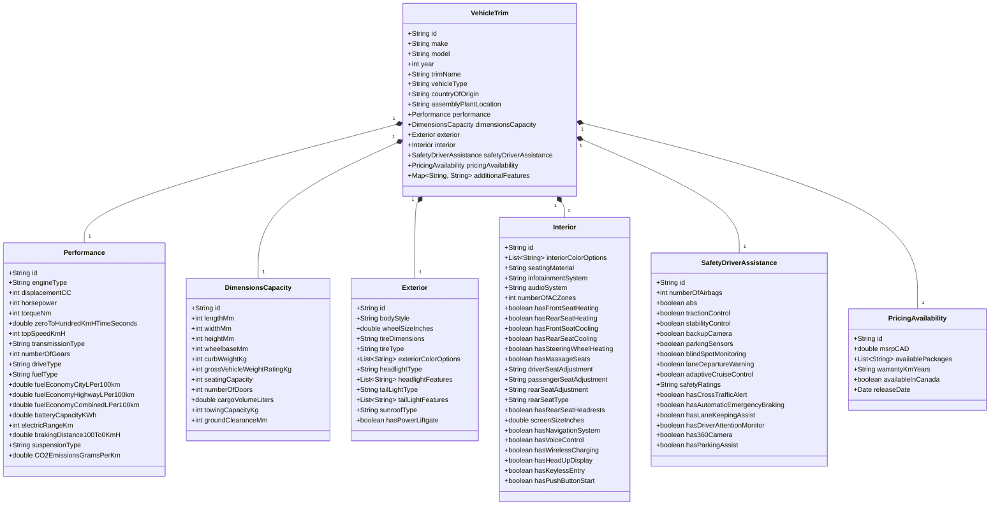

# Vehicle Specifications Data Model Design Document

## 1. Introduction
This document outlines the data model for storing specifications of personal vehicles (cars) sold in Canada. The primary goal is to provide comprehensive information to new buyers for informed decision-making and vehicle comparison. The data granularity is at the individual trim level, and all measurements are in metric units.

## 2. Data Model Overview
The data model is designed around a central `VehicleTrim` entity, which aggregates various categories of specifications. Each major category is represented as a separate logical entity (which can translate to separate tables in a relational database) to ensure modularity and maintainability. Unique identifiers (`id`) are included for each entity to facilitate relationships and data integrity. A flexible `additionalFeatures` field is included to accommodate future, unstructured attributes.

The overall architecture can be visualized as follows:

## 3. Entity Definitions and Attributes

### 3.1. VehicleTrim
Represents a specific trim level of a vehicle model.
*   `id`: (String) Unique identifier for the vehicle trim.
*   `make`: (String) Manufacturer of the vehicle (e.g., "Honda", "Ford").
*   `model`: (String) Model name of the vehicle (e.g., "Civic", "F-150").
*   `year`: (Integer) Model year of the vehicle (e.g., 2023).
*   `trimName`: (String) Specific trim level (e.g., "EX-L", "Lariat", "Sport").
*   `vehicleType`: (String) General type of vehicle (e.g., "Sedan", "SUV", "Truck", "Hatchback").
*   `countryOfOrigin`: (String) Country where the manufacturer is based.
*   `assemblyPlantLocation`: (String) Location of the primary assembly plant for this trim.
*   `additionalFeatures`: (Map<String, String>) A flexible key-value store for new or unstructured features not explicitly defined in the schema.

### 3.2. Performance
Details related to the vehicle's engine and driving dynamics.
*   `id`: (String) Unique identifier for the performance specifications.
*   `engineType`: (String) Type of engine (e.g., "Inline-4", "V6", "Electric", "Hybrid").
*   `displacementCC`: (Integer) Engine displacement in cubic centimeters.
*   `horsepower`: (Integer) Engine horsepower.
*   `torqueNm`: (Integer) Engine torque in Newton-meters.
*   `zeroToHundredKmHTimeSeconds`: (Double) Time to accelerate from 0 to 100 km/h in seconds.
*   `topSpeedKmH`: (Integer) Top speed in kilometers per hour.
*   `transmissionType`: (String) Type of transmission (e.g., "Automatic", "Manual", "CVT", "DCT").
*   `numberOfGears`: (Integer) Number of gears in the transmission.
*   `driveType`: (String) Drive type (e.g., "FWD", "RWD", "AWD", "4x4").
*   `fuelType`: (String) Type of fuel used (e.g., "Gasoline", "Diesel", "Electric", "Hybrid").
*   `fuelEconomyCityLPer100km`: (Double) Fuel economy in liters per 100 km (city driving).
*   `fuelEconomyHighwayLPer100km`: (Double) Fuel economy in liters per 100 km (highway driving).
*   `fuelEconomyCombinedLPer100km`: (Double) Fuel economy in liters per 100 km (combined driving).
*   `batteryCapacityKWh`: (Double) Battery capacity in kilowatt-hours (for EVs/PHEVs).
*   `electricRangeKm`: (Integer) Electric range in kilometers (for EVs/PHEVs).
*   `brakingDistance100To0KmH`: (Double) Braking distance from 100 km/h to 0 km/h in meters.
*   `suspensionType`: (String) Type of suspension (e.g., "MacPherson Strut", "Multi-link").
*   `CO2EmissionsGramsPerKm`: (Double) Carbon Dioxide emissions in grams per kilometer.

### 3.3. DimensionsCapacity
Physical dimensions and capacities of the vehicle.
*   `id`: (String) Unique identifier for the dimensions and capacity specifications.
*   `lengthMm`: (Integer) Overall length in millimeters.
*   `widthMm`: (Integer) Overall width in millimeters.
*   `heightMm`: (Integer) Overall height in millimeters.
*   `wheelbaseMm`: (Integer) Wheelbase in millimeters.
*   `curbWeightKg`: (Integer) Curb weight in kilograms.
*   `grossVehicleWeightRatingKg`: (Integer) Gross Vehicle Weight Rating in kilograms.
*   `seatingCapacity`: (Integer) Maximum seating capacity.
*   `numberOfDoors`: (Integer) Number of doors.
*   `cargoVolumeLiters`: (Double) Cargo volume in liters.
*   `towingCapacityKg`: (Integer) Maximum towing capacity in kilograms.
*   `groundClearanceMm`: (Integer) Ground clearance in millimeters.

### 3.4. Exterior
Attributes related to the vehicle's exterior features.
*   `id`: (String) Unique identifier for the exterior specifications.
*   `bodyStyle`: (String) Specific body style (e.g., "Sedan", "SUV", "Coupe", "Pickup").
*   `wheelSizeInches`: (Double) Wheel diameter in inches.
*   `tireDimensions`: (String) Full tire dimensions (e.g., "P225/45R17", "255/40ZR19").
*   `tireType`: (String) Type of tires (e.g., "All-season", "Summer", "Winter").
*   `exteriorColorOptions`: (List<String>) Available exterior color names.
*   `headlightType`: (String) Type of headlights (e.g., "Halogen", "LED", "Xenon", "Matrix LED").
*   `headlightFeatures`: (List<String>) Specific features of headlights (e.g., "Automatic High Beams", "Adaptive Front Lighting").
*   `tailLightType`: (String) Type of tail lights (e.g., "LED", "Incandescent").
*   `tailLightFeatures`: (List<String>) Specific features of tail lights (e.g., "Sequential Turn Signals").
*   `sunroofType`: (String) Type of sunroof (e.g., "Standard", "Panoramic", "Moonroof", "None").
*   `hasPowerLiftgate`: (Boolean) Indicates if the vehicle has a power liftgate.

### 3.5. Interior
Attributes related to the vehicle's interior features and comfort.
*   `id`: (String) Unique identifier for the interior specifications.
*   `interiorColorOptions`: (List<String>) Available interior color names.
*   `seatingMaterial`: (String) Material of the seats (e.g., "Cloth", "Leather", "Synthetic Leather").
*   `infotainmentSystem`: (String) Name or description of the infotainment system.
*   `audioSystem`: (String) Brand or description of the audio system (e.g., "Bose", "Harman Kardon", "Standard").
*   `numberOfACZones`: (Integer) Number of independent climate control zones.
*   `hasFrontSeatHeating`: (Boolean) Indicates if front seats have heating.
*   `hasRearSeatHeating`: (Boolean) Indicates if rear seats have heating.
*   `hasFrontSeatCooling`: (Boolean) Indicates if front seats have cooling.
*   `hasRearSeatCooling`: (Boolean) Indicates if rear seats have cooling.
*   `hasSteeringWheelHeating`: (Boolean) Indicates if the steering wheel has heating.
*   `hasMassageSeats`: (Boolean) Indicates if the vehicle has massage seats.
*   `driverSeatAdjustment`: (String) Description of driver seat adjustment (e.g., "Manual 6-way", "Power 10-way with lumbar").
*   `passengerSeatAdjustment`: (String) Description of passenger seat adjustment.
*   `rearSeatAdjustment`: (String) Description of rear seat adjustment (e.g., "Manual 4-way", "Power recline", "Fixed").
*   `rearSeatType`: (String) Type of rear seat (e.g., "Bench", "60/40 Split", "Captain's Chairs").
*   `hasRearSeatHeadrests`: (Boolean) Indicates if rear seats have headrests.
*   `screenSizeInches`: (Double) Size of the infotainment screen in inches.
*   `hasNavigationSystem`: (Boolean) Indicates if the vehicle has a built-in navigation system.
*   `hasVoiceControl`: (Boolean) Indicates if the vehicle has voice control features.
*   `hasWirelessCharging`: (Boolean) Indicates if the vehicle has wireless phone charging.
*   `hasHeadUpDisplay`: (Boolean) Indicates if the vehicle has a head-up display.
*   `hasKeylessEntry`: (Boolean) Indicates if the vehicle has keyless entry.
*   `hasPushButtonStart`: (Boolean) Indicates if the vehicle has push-button start.

### 3.6. SafetyDriverAssistance
Attributes related to safety features and driver assistance systems.
*   `id`: (String) Unique identifier for the safety and driver assistance specifications.
*   `numberOfAirbags`: (Integer) Total number of airbags.
*   `abs`: (Boolean) Anti-lock Braking System.
*   `tractionControl`: (Boolean) Traction Control System.
*   `stabilityControl`: (Boolean) Electronic Stability Control.
*   `backupCamera`: (Boolean) Rearview backup camera.
*   `parkingSensors`: (Boolean) Parking sensors (front/rear).
*   `blindSpotMonitoring`: (Boolean) Blind Spot Monitoring system.
*   `laneDepartureWarning`: (Boolean) Lane Departure Warning system.
*   `adaptiveCruiseControl`: (Boolean) Adaptive Cruise Control system.
*   `safetyRatings`: (String) Overall safety rating (e.g., "5-star NHTSA", "Top Safety Pick+ IIHS").
*   `hasCrossTrafficAlert`: (Boolean) Indicates if the vehicle has Rear Cross-Traffic Alert.
*   `hasAutomaticEmergencyBraking`: (Boolean) Indicates if the vehicle has Automatic Emergency Braking.
*   `hasLaneKeepingAssist`: (Boolean) Indicates if the vehicle has Lane Keeping Assist.
*   `hasDriverAttentionMonitor`: (Boolean) Indicates if the vehicle has a Driver Attention Monitor.
*   `has360Camera`: (Boolean) Indicates if the vehicle has a 360-degree camera system.
*   `hasParkingAssist`: (Boolean) Indicates if the vehicle has an automated parking assist feature.

### 3.7. PricingAvailability
Attributes related to pricing and market availability.
*   `id`: (String) Unique identifier for the pricing and availability specifications.
*   `msrpCAD`: (Double) Manufacturer's Suggested Retail Price in Canadian Dollars.
*   `availablePackages`: (List<String>) List of available packages or options.
*   `warrantyKmYears`: (String) Warranty details (e.g., "3 years/60,000 km bumper-to-bumper").
*   `availableInCanada`: (Boolean) Indicates if the vehicle trim is available for sale in Canada.
*   `releaseDate`: (Date) The initial release date of this trim level.

## 4. Data Storage and Technologies
*   **Database:** PostgreSQL (chosen for its robustness, open-source nature, and JSONB support for flexible schema).
*   **Data Transformation:** dbt (data build tool) for defining, testing, and documenting data models using SQL.
*   **Programming Language:** Python (for data ingestion, ETL, database interaction, analysis, and potential API development).
*   **Python Environment Management:** UV (for fast package installation and dependency resolution).
*   **Interactive Analysis:** Jupyter Notebooks (for exploratory data analysis, prototyping, and documentation).
*   **Workflow Orchestration:** Apache Airflow (for scheduling, monitoring, and managing data pipelines).

## 5. Project Management
*   **Kanban Board:** Trello (recommended for visual task tracking, simple and effective for agile development).
