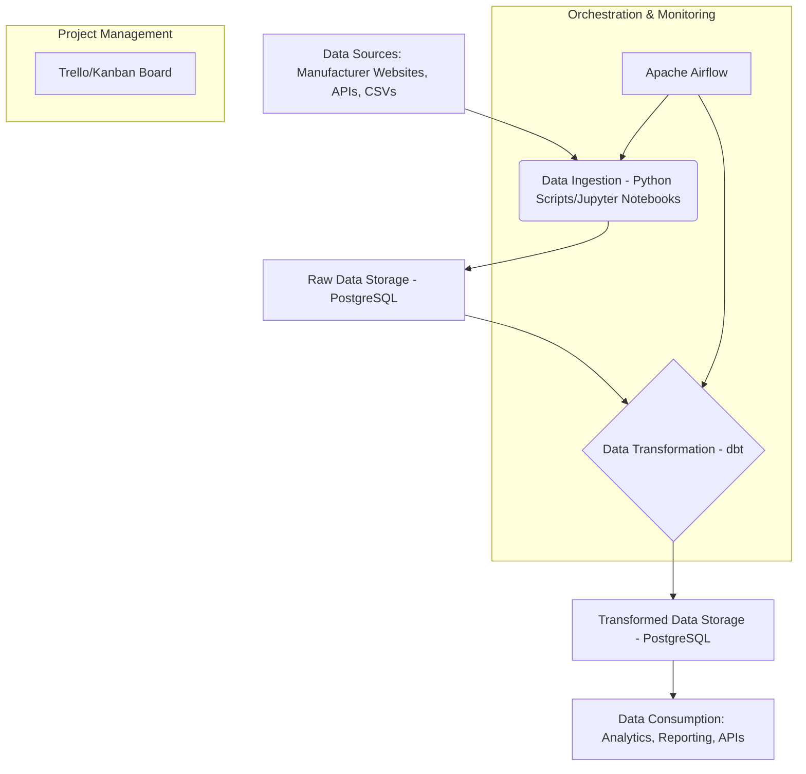

# Vehicle Specifications Data Storage System - Solution Document

## 1. Introduction
This document describes the overall architecture and component interactions for the Vehicle Specifications Data Storage System. The system aims to collect, store, transform, and present detailed specifications of personal vehicles (cars) sold in Canada, enabling informed decision-making and comparisons for new buyers.

## 2. System Architecture Overview

The system will follow a modern data stack approach, leveraging open-source technologies for flexibility, scalability, and maintainability.

## 3. Component Breakdown and Interaction

### 3.1. Data Sources
Various external sources will provide the raw vehicle specification data.
*   **Manufacturer Websites:** Primary source for detailed specifications. Requires web scraping.
*   **APIs:** If available from manufacturers or third-party data providers.
*   **CSVs/Excel Files:** Manual or periodic data dumps.

### 3.2. Data Ingestion (Python Scripts/Jupyter Notebooks)
This layer is responsible for extracting raw data from the sources and loading it into the raw data storage layer.
*   **Technology:** Python scripts, potentially developed and iterated upon in Jupyter Notebooks.
*   **Libraries:** `requests` for API calls, `BeautifulSoup` or `Scrapy` for web scraping, `pandas` for initial data cleaning and structuring, `psycopg2` or `SQLAlchemy` for loading into PostgreSQL.
*   **Functionality:**
    *   Connect to various data sources.
    *   Extract raw vehicle specification data.
    *   Perform light initial cleaning (e.g., handling encoding issues, basic type conversions).
    *   Load raw data into designated staging tables in PostgreSQL.
*   **Interaction:** Triggered by Apache Airflow.

### 3.3. Raw Data Storage (PostgreSQL)
This is the landing zone for all ingested data, stored in its original or near-original format.
*   **Technology:** PostgreSQL database.
*   **Purpose:** To maintain an immutable record of raw data, allowing for re-processing if transformation logic changes.
*   **Schema:** Staging tables will be created to mirror the structure of the incoming raw data.

### 3.4. Data Transformation (dbt)
This is the core transformation layer where raw data is cleaned, validated, and modeled into the final, structured schema.
*   **Technology:** dbt (data build tool).
*   **Language:** SQL (with Jinja templating).
*   **Functionality:**
    *   Define data models (e.g., `VehicleTrim`, `Performance`, `DimensionsCapacity`, etc.) as SQL views or tables.
    *   Implement data quality checks and tests (e.g., ensuring `id` uniqueness, valid ranges for numerical attributes).
    *   Join and aggregate data from raw tables to create the refined data model.
    *   Handle the `additionalFeatures` JSONB field for flexible attribute storage.
    *   Generate documentation for all models and their relationships.
*   **Interaction:** dbt commands (`dbt run`, `dbt test`, `dbt docs generate`) will be executed by Apache Airflow.

### 3.5. Transformed Data Storage (PostgreSQL)
This layer holds the clean, transformed, and ready-to-use vehicle specification data.
*   **Technology:** PostgreSQL database.
*   **Purpose:** To serve as the single source of truth for vehicle specifications, optimized for querying and consumption.
*   **Schema:** Tables will strictly adhere to the defined data model (as per `DESIGN_DOCUMENTATION.md`), with appropriate data types and relationships. `JSONB` will be used for the `additionalFeatures` column.

### 3.6. Data Consumption
This layer represents how the processed data will be utilized.
*   **Analytics & Reporting:** Business intelligence tools or custom Python scripts/Jupyter Notebooks can connect directly to the transformed data tables for analysis and report generation.
*   **APIs:** A future component could be a RESTful API (e.g., built with Python Flask/FastAPI) that exposes the vehicle data for external applications (e.g., a comparison website for buyers).

### 3.7. Orchestration & Monitoring (Apache Airflow)
Airflow will manage the end-to-end data pipeline, ensuring tasks run in the correct order and on schedule.
*   **Technology:** Apache Airflow.
*   **Functionality:**
    *   Define DAGs (Directed Acyclic Graphs) in Python to represent workflows (e.g., `ingest_vehicle_data` -> `run_dbt_transformations`).
    *   Schedule daily/weekly runs for data updates.
    *   Monitor task status, retry failures, and send alerts.
    *   Provide a web UI for visualizing pipeline runs and logs.
*   **Interaction:** Triggers Python ingestion scripts and dbt CLI commands.

### 3.8. Project Management (Trello/Kanban Board)
For agile project tracking and collaboration.
*   **Technology:** Trello (or similar Kanban tool).
*   **Functionality:**
    *   Visualize tasks in different stages (e.g., To Do, In Progress, Done).
    *   Assign tasks, set due dates, and add descriptions.
    *   Facilitate communication and progress tracking.

## 4. Data Flow and Relationships

1.  Raw vehicle data is extracted from various **Data Sources**.
2.  **Python Ingestion Scripts** (orchestrated by Airflow) pull this data and load it into **Raw Data Storage (PostgreSQL)**.
3.  **dbt** (orchestrated by Airflow) reads from the raw data tables in PostgreSQL, applies transformations, validations, and modeling logic.
4.  The transformed, clean data is then written back to **Transformed Data Storage (PostgreSQL)**.
5.  **Data Consumers** (analytics tools, reporting, APIs) query the transformed data for insights and applications.
6.  **Apache Airflow** oversees the entire process, ensuring scheduled execution, monitoring, and error handling.
7.  **Trello/Kanban Board** tracks the development tasks and progress of the entire project.

This architecture provides a robust, scalable, and maintainable foundation for your vehicle specifications data storage system.